<div align=center>

</div>

## <div align=center>💡What I Know</div>

<div align=center>
 
 
 
 
 
 
 
 
</div>
<hr>

## <div align=center>🤝Let's Connect</div>

<div align=center>
  <a href="https://www.linkedin.com/in/manoj-joshi-6b7662166/">
 
 </a>
 <a href="mailto:manoj.joshi.public@gmail.com">
 
 </a>
</div>
<hr>

## <div align=center>🧑‍💻about me😊</div>

```python
def myLife():
    print("hi👋, i am manoj joshi")
    print("a passionate web developer from nepal[🇳🇵]")
    currentlyLearning = "next.js"
    reachMeAt="manoj.joshi.public@gmail.com"
    funFact = "i am single 😅"

    # i love gaming, music && .....

life()
```
